# Medicaid NPI: Landing → Report Lineage

Schematic of data flow from landing sources through all transformations to the final report models. State is controlled by `var('state_code')` (default FL); run-scoped models use **nppes_run** and **billing_servicing_pairs_run**.

---

## New sequence (from landing)

```
LANDING
├── landing_medicaid_npi
│   ├── stg_pml          (program_state, product on each row)
│   ├── stg_tml
│   ├── stg_ppl
│   ├── stg_doge
│   └── stg_nucc_taxonomy
└── nppes_public.npi_optimized

RUN STAGING (filter by state_code, product)
├── stg_pml_run    ← stg_pml   WHERE program_state = var('state_code'), product = var('product')
├── stg_tml_run    ← stg_tml   (same filter)
└── stg_ppl_run    ← stg_ppl   (same filter)

FOUNDATION (no state filter)
├── billing_servicing_pairs  ← stg_doge
├── nppes                     ← npi_optimized (view; adds practice_state)
└── nucc_taxonomy             ← stg_nucc_taxonomy

STATE-SCOPED RUN (var('state_code'))
├── nppes_run                 ← nppes   WHERE practice_state = var('state_code')
└── billing_servicing_pairs_run  ← billing_servicing_pairs INNER JOIN nppes_run (both NPIs in state)

FROM RUN STAGING
├── medicaid_provider_ids     ← stg_pml_run
└── fl_medicaid_taxonomy      ← stg_tml_run

STATE-SCOPED MARTS (depend on nppes_run / billing_servicing_pairs_run)
├── organizations             ← billing_servicing_pairs_run, npi_optimized
├── nppes_taxonomies_unpivoted_fl  ← nppes_run
├── npi_addresses_fl          ← stg_pml_run, nppes_run
├── b0_facility_master_fl     ← b0_facility_taxonomy_codes, nppes_run, nppes_taxonomies_unpivoted_fl
├── b0_sub_org_address_fl    ← b0_facility_master_fl
├── b0_address_propensity_fl  ← b0_sub_org_address_fl, npi_addresses_fl
├── b0_sub_org_members_fl     ← b0_address_propensity_fl
├── b0_billing_npi_members_fl ← billing_servicing_pairs_run
├── b0_roster_list_fl         ← b0_sub_org_members_fl, b0_billing_npi_members_fl
├── taxonomy_prevalence_fl    ← nppes_taxonomies_unpivoted_fl, nppes_run, fl_medicaid_taxonomy
├── taxonomy_hcpcs_volume_fl  ← nppes_taxonomies_unpivoted_fl, billing_servicing_pairs_run
├── taxonomy_hcpcs_volume_indexed_fl  ← taxonomy_hcpcs_volume_fl
├── address_validation_fl     ← billing_servicing_pairs_run, npi_addresses_fl
├── taxonomy_validation_fl    ← billing_servicing_pairs_run, fl_medicaid_taxonomy, nppes_run, nppes_taxonomies_unpivoted_fl, stg_pml_run
├── b3_taxonomy_alignment_fl  ← fl_medicaid_taxonomy, nppes_taxonomies_unpivoted_fl
├── b4_medicaid_id_roster_fl  ← medicaid_provider_ids
├── b4_npi_medicaid_status_fl ← b4_medicaid_id_roster_fl, nppes_run
├── provider_readiness        ← billing_servicing_pairs_run, nppes_run, stg_pml_run, stg_ppl_run
└── provider_readiness_summary ← provider_readiness

ANALYSIS & REPORT
├── provider_missed_opportunities_fl, provider_danger_opportunities_fl, provider_taxonomy_coverage_fl, ...
├── provider_readiness_report  ← provider_readiness, address_validation_fl, taxonomy_validation_fl, organizations, npi_optimized
├── provider_readiness_executive_summary
├── provider_propensity_score_fl
└── b6_integrated_report_fl    ← b0_roster_list_fl, npi_addresses_fl, b3_taxonomy_alignment_fl, b4_*, b0_sub_org_address_fl, nppes_run, organizations
```

**Switch state:** `dbt run --vars '{"state_code": "TX"}'` (with landing loaded for TX).

---

## Landing / Source Tables

| Source | Table | Description |
|--------|-------|-------------|
| **nppes_public** | npi_optimized | NPI provider data (bigquery-public-data) |
| **nppes_public** | npi_raw | Raw NPI data |
| **landing_medicaid_npi** | stg_pml | Provider Master List (AHCA) |
| **landing_medicaid_npi** | stg_tml | Taxonomy Master List |
| **landing_medicaid_npi** | stg_ppl | Pending Provider List |
| **landing_medicaid_npi** | stg_doge | DOGE Medicaid Provider Spending |
| **landing_medicaid_npi** | medicaid_provider_spending | Raw HHS Medicaid Provider Spending |
| **landing_medicaid_npi** | stg_nucc_taxonomy | NUCC taxonomy (load via `scripts/load_nucc_to_landing.py`) |

Defined in: `models/sources/medicaid_sources.yml`

---

## Schematic (Mermaid)

```mermaid
flowchart TB
    subgraph LANDING [Landing Sources]
        NPPES[nppes_public.npi_optimized]
        PML[stg_pml]
        TML[stg_tml]
        PPL[stg_ppl]
        DOGE[stg_doge / medicaid_provider_spending]
        NUCC[stg_nucc_taxonomy]
    end

    subgraph FOUNDATION [Foundation]
        nppes_providers[nppes_providers]
        medicaid_provider_ids[medicaid_provider_ids]
        fl_medicaid_taxonomy[fl_medicaid_taxonomy]
        billing_servicing_pairs[billing_servicing_pairs]
        billing_patterns[billing_patterns]
        nucc_taxonomy[nucc_taxonomy]
    end

    subgraph RUN [State-scoped run: var state_code]
        nppes_run[nppes_run]
        bsp_run[billing_servicing_pairs_run]
        nppes_tax_unpiv[nppes_taxonomies_unpivoted_fl]
        tax_prev[taxonomy_prevalence_fl]
        tax_combo[taxonomy_combo_turf_fl]
        tax_hcpcs[taxonomy_hcpcs_volume_fl]
        tax_hcpcs_idx[taxonomy_hcpcs_volume_indexed_fl]
        npi_addr[npi_addresses_fl]
        addr_val[address_validation_fl]
        tax_val[taxonomy_validation_fl]
        orgs[organizations]
        pr_read[provider_readiness]
        pr_summary[provider_readiness_summary]
    end

    subgraph ANALYSIS [Analysis Marts]
        cov[provider_taxonomy_coverage_fl]
        missed[provider_missed_opportunities_fl]
        danger[provider_danger_opportunities_fl]
    end

    subgraph FINAL [Final Report]
        PRR[provider_readiness_report]
        PRES[provider_readiness_executive_summary]
        PPS[provider_propensity_score_fl]
    end

    NPPES --> nppes_providers
    NPPES --> nppes_run
    PML --> medicaid_provider_ids
    PML --> npi_addr
    TML --> fl_medicaid_taxonomy
    PPL --> pr_read
    DOGE --> billing_servicing_pairs
    NUCC --> nucc_taxonomy

    billing_servicing_pairs --> bsp_run
    nppes_run --> bsp_run
    nppes_run --> nppes_tax_unpiv
    nppes_run --> npi_addr
    bsp_run --> orgs

    nppes_tax_unpiv --> tax_prev
    nppes_tax_unpiv --> tax_combo
    bsp_run --> tax_hcpcs
    nppes_tax_unpiv --> tax_hcpcs
    tax_hcpcs --> tax_hcpcs_idx

    npi_addr --> addr_val
    bsp_run --> addr_val
    bsp_run --> tax_val
    fl_medicaid_taxonomy --> tax_val
    nppes_tax_unpiv --> tax_val
    nppes_run --> tax_val
    tax_hcpcs_idx --> tax_val
    PML --> tax_val

    bsp_run --> pr_read
    NPPES --> pr_read
    PML --> pr_read
    pr_read --> pr_summary

    tax_prev --> cov
    nppes_tax_unpiv --> cov
    tax_prev --> missed
    tax_hcpcs --> missed
    nppes_tax_unpiv --> missed
    tax_hcpcs_idx --> danger
    nppes_tax_unpiv --> danger
    bsp_run --> danger

    pr_read --> PRR
    addr_val --> PRR
    tax_val --> PRR
    orgs --> PRR
    NPPES --> PRR

    PRR --> PRES
    pr_summary --> PRES
    PRR --> PPS
```



---

## Hierarchical Outline

```
LANDING
├── nppes_public.npi_optimized, npi_raw
└── landing_medicaid_npi
    ├── stg_pml (Provider Master List)
    ├── stg_tml (Taxonomy Master List)
    ├── stg_ppl (Pending Provider List)
    ├── stg_doge / medicaid_provider_spending
    └── stg_nucc_taxonomy

FOUNDATION
├── nppes                     ← npi_optimized (view; adds practice_state)
├── nppes_providers           ← npi_optimized
├── medicaid_provider_ids     ← stg_pml_run
├── fl_medicaid_taxonomy      ← stg_tml_run
├── billing_servicing_pairs   ← stg_doge
├── billing_patterns
└── nucc_taxonomy             ← stg_nucc_taxonomy  [nucc_taxonomy.sql]

STATE-SCOPED RUN (var state_code)
├── nppes_run                         ← nppes WHERE practice_state = var('state_code')
└── billing_servicing_pairs_run       ← billing_servicing_pairs, nppes_run

STATE-SCOPED MARTS
├── nppes_taxonomies_unpivoted_fl    ← nppes_run
├── billing_servicing_pairs_run       (see above)
├── taxonomy_prevalence_fl            ← nppes_taxonomies_unpivoted_fl, nppes_run, fl_medicaid_taxonomy
├── taxonomy_combo_turf_fl            ← nppes_taxonomies_unpivoted_fl
├── taxonomy_hcpcs_volume_fl          ← billing_servicing_pairs_run, nppes_taxonomies_unpivoted_fl
├── taxonomy_hcpcs_volume_indexed_fl  ← taxonomy_hcpcs_volume_fl
├── npi_addresses_fl                  ← stg_pml_run, nppes_run  [npi_addresses_fl.sql]
├── address_validation_fl            ← npi_addresses_fl, billing_servicing_pairs_run
├── taxonomy_validation_fl            ← billing_servicing_pairs_run, fl_medicaid_taxonomy, nppes_run, nppes_taxonomies_unpivoted_fl, taxonomy_hcpcs_volume_indexed_fl, stg_pml_run
├── organizations                     ← billing_servicing_pairs_run, npi_optimized  [organizations.sql]
├── provider_readiness               ← billing_servicing_pairs_run, nppes_run, stg_pml_run, stg_ppl_run
└── provider_readiness_summary        ← provider_readiness

ANALYSIS MARTS
├── provider_taxonomy_coverage_fl     [provider_taxonomy_coverage_fl.sql]
├── provider_missed_opportunities_fl  [provider_missed_opportunities_fl.sql]
└── provider_danger_opportunities_fl  [provider_danger_opportunities_fl.sql]

FINAL REPORT
├── provider_readiness_report         [provider_readiness_report.sql]
│   refs: provider_readiness, address_validation_fl, taxonomy_validation_fl, organizations, npi_optimized
├── provider_readiness_executive_summary  [provider_readiness_executive_summary.sql]
│   refs: provider_readiness_report, provider_readiness_summary
└── provider_propensity_score_fl      [provider_propensity_score_fl.sql]
    refs: provider_readiness_report
```

---

## Run Order (Build Report)

```bash
# 1. Load NUCC (if stg_nucc_taxonomy empty)
python scripts/load_nucc_to_landing.py

# 2. Build full report chain
dbt run --select +provider_readiness_report +provider_readiness_executive_summary +provider_propensity_score_fl

# With optional PML columns (when available)
dbt run --select +provider_readiness_report --vars '{"use_pml_address": true, "use_pml_taxonomy": true}'
```

---

## Models Implemented in This Project

| Model | File |
|-------|------|
| nucc_taxonomy | nucc_taxonomy.sql |
| organizations | organizations.sql |
| npi_addresses_fl | npi_addresses_fl.sql |
| taxonomy_validation_fl | taxonomy_validation_fl.sql |
| provider_readiness_report | provider_readiness_report.sql |
| provider_readiness_executive_summary | provider_readiness_executive_summary.sql |
| provider_propensity_score_fl | provider_propensity_score_fl.sql |
| provider_taxonomy_coverage_fl | provider_taxonomy_coverage_fl.sql |
| provider_missed_opportunities_fl | provider_missed_opportunities_fl.sql |
| provider_danger_opportunities_fl | provider_danger_opportunities_fl.sql |

Upstream models (nppes_run, billing_servicing_pairs_run, provider_readiness, etc.) are in this project; state is set via `var('state_code')`.
