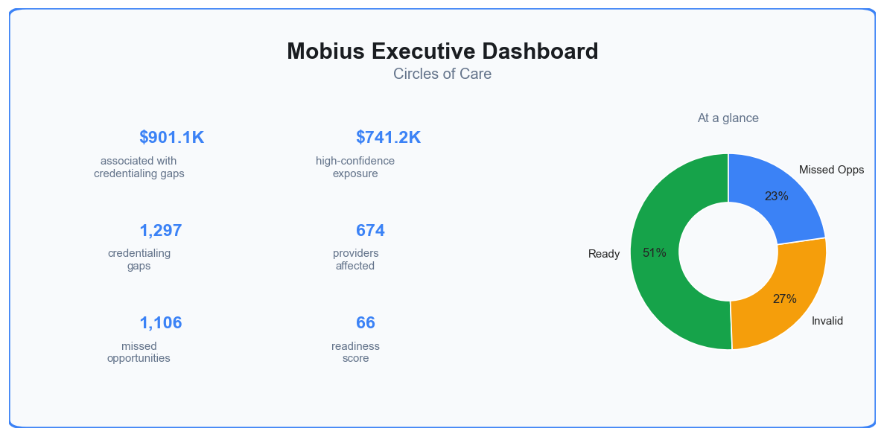
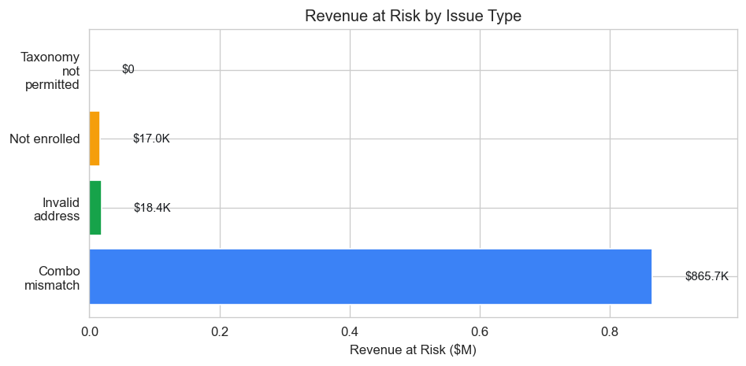
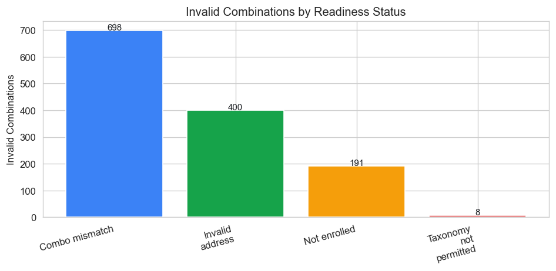
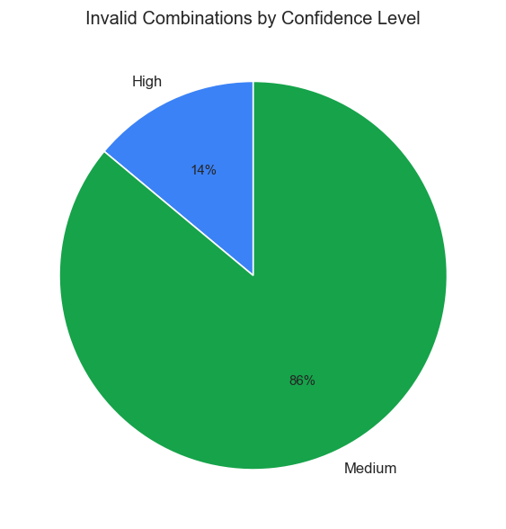

## CEO Summary

Mobius has identified **$901,143.78** in annual Medicaid revenue associated with credentialing gaps across **674** providers, including **$741,231.34** in high-confidence exposure. By deploying our automated Enrollment and Roster Sync workflows, Circles of Care **can help protect** this revenue and access **opportunities to potentially unlock** additional billing from **1,106** potential missed opportunities identified in state data.

---

### Mobius Executive Dashboard

*This dashboard provides a high-level overview of credentialing readiness and potential revenue impact.*

---

## Executive Overview

Circles of Care manages **2,130** unique NPIs across **3,761** provider-taxonomy-location combinations in our data. Our assessment reveals **1,297** combinations (**34.5%**) have credentialing gaps that are **highly likely to block** compliant Medicaid billing. This translates to an estimated **$901,143.78** in annual Medicaid revenue at risk, with **$741,231.34** in high-confidence exposure. Proactively addressing these gaps is critical to protect revenue and operational efficiency. Mobius's automated workflows are designed to resolve these deficiencies, safeguarding existing revenue and enabling **opportunities to potentially unlock** additional billing from **1,106** identified missed opportunities. Positively, **no ghost billing was detected** in our claims data (checked DOGE claims, last 12 months), indicating strong initial roster management.

## Why This Matters

For Circles of Care, Mobius converts complex Medicaid credentialing rules into a single operational view, pinpointing **1,297** combinations **highly likely to block** Medicaid billing before claims are submitted. This translates to an urgent need to protect **$901,143.78** in annual revenue and unlock **1,106** potential new billing opportunities. Mobius **automatically generates** operational workflows to resolve these issues, directly impacting your organization's financial health and operational efficiency.

## Methodology

This report is an **outside-in** view of provider roster and credentialing readiness. We use only the data sources available to us — we do not have access to the organization's internal records or ground truth. What we show is derived from those sources; it can contain errors, timing lags, or misclassification.

**Data freshness:** Data current as of: 2026-03-04T22:31:55.478302. Sources: FL PML snapshot, roster, and claims data.

**What we use:** (1) A provider roster that links organizations to locations and servicing providers, built from state enrollment data, federal provider data (NPPES), and historical billing patterns. (2) Florida Medicaid enrollment and taxonomy lists (PML, TML, PPL). (3) Claims or expenditure data for ghost billing and run rates. All of this is external or aggregated data — not the org's own HR or credentialing system.

**What we do:** For each organization and location in scope, we list servicing providers (NPIs) tied to that location in our roster. For each of those NPIs we run four checks against Medicaid and federal data: Is the NPI enrolled in Medicaid? Does the address have a valid 9-digit ZIP+4? Is the taxonomy allowed? Does the specific combination of NPI, taxonomy, and location have a valid Medicaid ID? We then flag rows where any check fails and surface missed opportunities and ghost billing (claims under the org's billing NPI where the servicing NPI is not on our roster).

**Unit of analysis:** A "combination" is one row: a specific NPI, taxonomy, and service location (ZIP+4). One provider can have multiple combinations (e.g., different locations or specialties). Counts of "Ready" and "invalid" are at this combination level.

**Confidence in roster attribution:** Each roster row has a **confidence score** (0–100) indicating how strongly we believe that this NPI belongs at this location. It is based on factors such as billing history (DOGE), address match strength, and building density. High confidence (e.g., 70–100) means we are more sure the NPI is truly with the organization at that site; medium (40–69) or low (0–39 / missing) means the link may be inferred or weak — e.g., same building but many unrelated offices, or no recent billing. The report breaks down invalid combinations by confidence so you can distinguish "what we are confident is real" from "what might be a data artifact or something we have missed." Use this to prioritize verification: high-confidence invalid combos are more likely to be true gaps; low-confidence ones may be false positives or roster noise.

**Important limitations:** Results are not guaranteed to be correct or complete. For example, many NPIs we flag as "Not enrolled" may have enrolled since our data was updated, may no longer be with the organization, or may be misattributed in our roster. Combo mismatches can reflect data lag between the state and the org. Use this report as a starting point for operational review and verification with the organization's own data — not as a definitive audit.

## Mobius Medicaid Readiness Score: 66 / 100

Circles of Care's Mobius Medicaid Readiness Score of **66 / 100** places it near the median (**68**) for comparable FL behavioral health organizations. This signals clear and significant **opportunity to improve** and aim for top quartile performance (**82**), directly impacting revenue protection and expansion.

## Key Findings

Our analysis reveals several areas where credentialing processes **can be optimized** to protect revenue and unlock new billing opportunities. Claims associated with these combinations are actively billing — denial risk is present today. If nothing is done in 90–180 days, continued billing under invalid combos increases exposure to claim denial and delayed reimbursement.

### Summary Metrics

| Metric | Count | Percentage |
| :-------------------------------- | ----: | ---------: |
| Total NPIs | 2,130 | |
| NPIs with all checks passing | 1,456 | 68.4% |
| NPIs with at least one issue | 674 | 31.6% |
| Total Combinations | 3,761 | |
| Ready Combinations | 2,464 | 65.5% |
| Invalid Combinations | 1,297 | 34.5% |

### Revenue at Risk and Opportunity

Mobius has identified an estimated **$901,143.78** in annual Medicaid revenue associated with credentialing gaps across **674** NPIs. Furthermore, we've identified **1,106** potential missed opportunities, which could unlock approximately **$153,687.74** in new annual billing if just 20% are activated. This represents a significant opportunity to expand services and revenue.

*Missed opportunities:* Locations in scope where no servicing NPI has all four checks pass in our data, or NPIs that appear in PML but do not have a matching NPI+taxonomy+ZIP9 combo in our check. Resolving alignment unlocks billing potential.

### Readiness Status Breakdown (Top Problems)

The following table details the primary reasons for invalid combinations and their estimated annual revenue impact.

| Issue Type | Invalid Combinations | % of Total Invalid | Estimated Annual Revenue Impact |
| :------------------------- | -------------------: | -----------------: | ------------------------------: |
| Combo mismatch | 698 | 53.8% | $865,748.92 |
| Invalid address | 400 | 30.8% | $18,358.18 |
| Not enrolled | 191 | 14.7% | $17,036.68 |
| Taxonomy not permitted | 8 | 0.6% | $0.00 |

For 'Taxonomy not permitted,' the $0.00 impact indicates these specific combinations have not generated historical billing, minimizing immediate denial risk but still representing a credentialing gap that is **highly likely to block** future compliant billing.

*Based on 2024 DOGE billing run rate per physician by taxonomy and location; applies run rate to distinct providers with invalid combos in each taxonomy-location cell.*

### Revenue at Risk by Issue Type

*This chart visually represents the financial impact associated with different types of credentialing gaps.*

### Invalid Combinations by Readiness Status

*This chart breaks down the types of credentialing issues affecting provider combinations.*

### Confidence in Revenue at Risk

Mobius evaluates the confidence of each NPI-location attribution. High-confidence issues are those where we are most certain the NPI is associated with your organization.

| Confidence Level | Revenue Impact |
| :--------------- | -------------: |
| High | $741,231.34 |
| Medium | $159,912.44 |
| Low | $0.00 |

**Confidence Note:** **181** invalid combinations are categorized as high confidence, meaning Mobius is very confident in the attribution of the NPI to the organization at that location. An additional **1,116** invalid combinations are at medium confidence. Prioritizing resolution for high-confidence issues **can yield** the most immediate and verifiable impact.

### Invalid Combinations by Confidence Level

*This chart categorizes invalid combinations by Mobius's confidence in the provider-location attribution.*

### Sample Invalid Combinations

Here are illustrative examples of specific invalid combinations that require attention:

| Servicing NPI | Provider Name | Readiness Status | Summary | Suggested Action | Suggested Taxonomies |
| :------------ | :----------------------- | :--------------- | :--------------------------------------------------------------------------------------------------------------------------------------------------------------------------------------------------------------------------------------------------------------- | :----------------------------------------------------------------------------------- | :------------------- |
| 1013091784 | BREDIKIS, AUDRIUS | Combo mismatch | NPI is enrolled in PML (Provider Master List) and has a Medicaid ID. NPPES practice address has valid 9-digit ZIP+4. Provider taxonomy is permitted in Florida Medicaid (on TML). PML has no matching roster combination at this location/taxonomy. | PML has this taxonomy at a different ZIP. Update PML service location to match NPPES, or align roster address. | |
| 1013978055 | SEILER, EARNEST | Invalid address | NPI is enrolled in PML (Provider Master List) and has a Medicaid ID. NPPES practice ZIP+4 is not 9 digits. Expect ZIP5 + 4-digit extension (e.g. 123451234). Provider taxonomy is permitted in Florida Medicaid (on TML). This provider's NPPES address lacks the required 9-digit ZIP+4. | | |
| 1013994698 | HIBBARD, MARY FRANCES | Invalid address | NPI is enrolled in PML (Provider Master List) and has a Medicaid ID. NPPES practice ZIP+4 is not 9 digits. Expect ZIP5 + 4-digit extension (e.g. 123451234). Provider taxonomy is permitted in Florida Medicaid (on TML). This provider's NPPES address lacks the required 9-digit ZIP+4. | | |
| 1013998970 | BADOLATO, CRAIG | Combo mismatch | NPI is enrolled in PML (Provider Master List) and has a Medicaid ID. NPPES practice address has valid 9-digit ZIP+4. Provider taxonomy is permitted in Florida Medicaid (on TML). PML has no matching roster combination at this location/taxonomy. | PML has this taxonomy at a different ZIP. Update PML service location to match NPPES, or align roster address. | |
| 1023003514 | MCCARTHY-LAVISH, MICHELE | Combo mismatch | NPI is enrolled in PML (Provider Master List) and has a Medicaid ID. NPPES practice address has valid 9-digit ZIP+4. Provider taxonomy is permitted in Florida Medicaid (on TML). PML has no matching roster combination at this location/taxonomy. | PML has a different taxonomy at this ZIP. Add roster taxonomy to PML, or use PML taxonomy on roster. | |

## Ghost Billing Summary

No ghost billing detected (checked DOGE claims, last 12 months). This is a positive indicator of strong control over billing NPIs relative to servicing NPIs, and minimizes potential compliance risks from unknown providers billing under the organization's tax ID.

## Location Summary

Mobius has identified the following **7 primary locations** for Circles of Care, which are central to understanding and resolving credentialing issues. Ensuring robust data hygiene and credentialing for each of these sites is critical to protect revenue and operational integrity.

| Standardized Location (City, State, ZIP) |